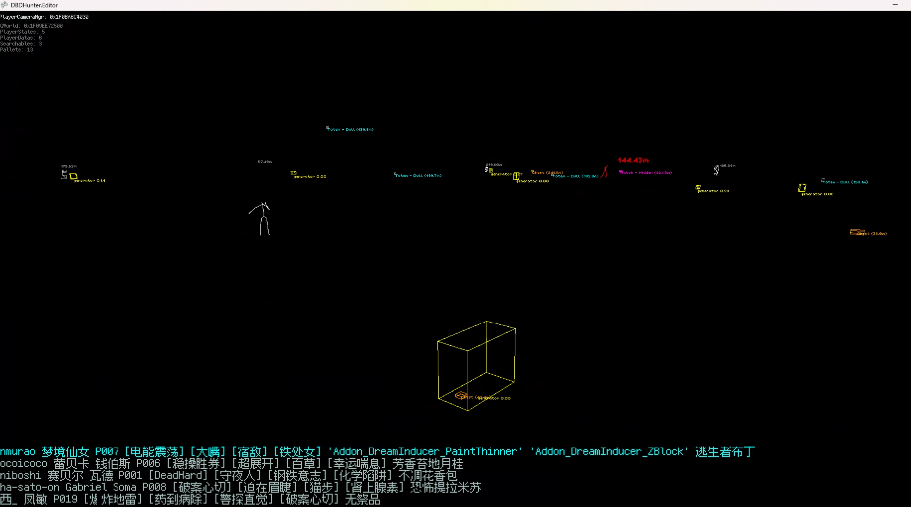

# DBDHunter
A external hack for Dead by Daylight using DMA, powered by Murder Game Engine.

## Features
### ESP
* Show killer, survivors, totems, hatches, pallets, generators and more
* Bone ESP
* Show all totems with a hex perk

### Miscellaneous
* Show killer and survivors perks

## To Compile
Don't ask me any questions about project compilation, please explore on your own.

## Setup
1. Launch DBDHunter.Editor
2. Open Editor Settings, and set "Game Source Path" to "$(repository)/src/DBDHunter", the $(repository) is your absolute directory of the project
3. Copy the data and ecs under the $(repository)/src/DBDHunter/resources/assets directory to the DBDHunter.Editor output directory under $(repository)/src/DBDHunter.Editor/bin/DebugMurderFNA/resources/assets/data
4. Then reopen DBDHunter.Editor. If the settings are correct, you should be able to see resources such as Features, World, and Libraries.
5. Open Game Profile, set the value of Library, and then set the value of Starting Scene
6. click 'Play Game'

## Show

## Dependencies
* [murder](https://github.com/isadorasophia/murder)
* [DigitalRune](https://github.com/DigitalRune/DigitalRune)
* [MemProcFS](https://github.com/ufrisk/MemProcFS)
